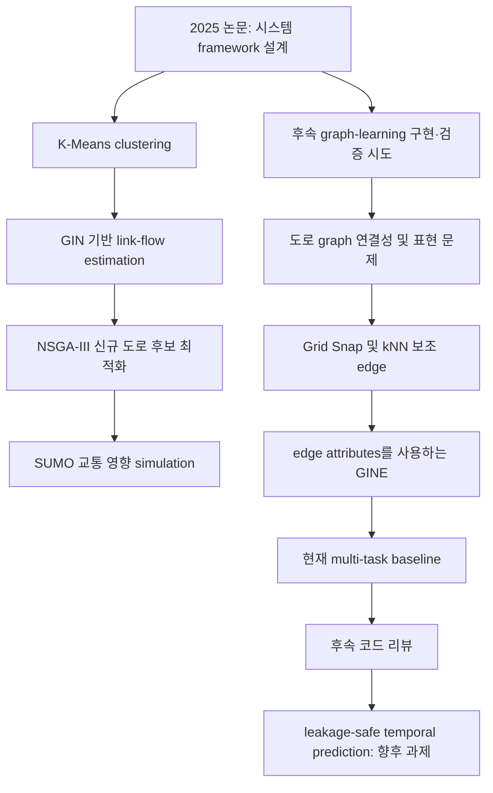
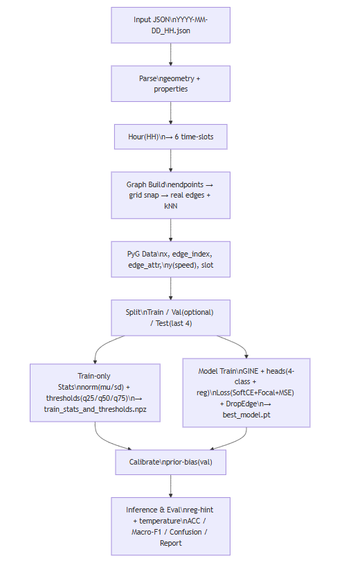

# GINE 기반 도로 속도 분위수 실험 baseline

## 프로젝트 개요

이 저장소는 연구 과정에서 사용된 GINE 기반 도로 속도 분석 실험 baseline을 보존합니다.

선행 논문은 신규 도로 개설 효과를 분석하기 위한 `K-Means → GIN → NSGA-III → SUMO` 기반 시스템 framework를 설계했습니다. 이 저장소는 그 전체 시스템의 구현체가 아닙니다. 이후 실제 도로 데이터를 대상으로 graph-learning 구현과 검증을 시도하는 과정에서 도로 graph의 연결성과 표현 방식에 관한 문제를 확인했고, 이를 다루기 위해 Grid Snap, kNN 보조 edge, GINE, edge attributes, 속도 분위수 classification과 속도 regression을 결합한 multi-task 실험으로 확장했습니다.

현재 코드는 historical experimental baseline입니다. 이후 코드 리뷰에서 evaluation 설계의 한계도 확인되었으므로, 기존 결과를 미래 교통 상태 forecasting 성능으로 해석하지 않습니다.

```text
논문 framework 설계
  → 후속 구현·검증 시도
  → graph connectivity / representation 문제 확인
  → Grid Snap + kNN + GINE + edge attributes
  → 속도 분위수 classification + 속도 regression multi-task 실험
  → 코드 리뷰를 통한 evaluation limitation 확인
  → temporal prediction은 향후 과제
```

## 프로젝트 상태

- 이 저장소는 연구 과정에서 사용된 historical experimental baseline을 보존합니다.
- 현재 구현은 선행 논문에서 설계한 전체 `K-Means → GIN → NSGA-III → SUMO` pipeline을 포함하지 않습니다.
- 후속 코드 리뷰에서 information leakage를 포함한 실험 설계상의 한계를 확인했습니다.
- 따라서 기존 출력은 미래 교통 상태 forecasting 성능으로 해석하지 않습니다.
- 재학습이 필요한 temporal formulation은 별도 후속 실험 과제입니다.
- 이 문서는 검증되지 않은 accuracy, F1, RMSE, MAE 등의 성능 수치를 제시하지 않습니다.

## 연구 배경

### 선행 연구

선행 연구는 다음 학회 논문입니다.

- 노재준, 박성진, 신동화, 허주완, 이현주, 이선호, 송유정, 「SUMO 기반 도시 교통 시뮬레이션을 활용한 신규 도로 개설 효과 분석 시스템 설계」
- 2025년도 한국멀티미디어학회 추계학술발표대회 논문집 제28권 2호

논문은 아산시를 대상으로 교통 simulation 기반으로 신규 도로 개설 효과를 사전에 분석하는 시스템을 설계했습니다. 입력으로는 OpenStreetMap 도로 network와 연결 관계, 길이, 차량 최대속도 등의 link 단위 도로 속성을 사용합니다.

논문에서 제안한 system-design pipeline은 다음과 같습니다.

```text
OpenStreetMap 도로 network 데이터
  → K-Means clustering
  → GIN 기반 link-flow estimation
  → NSGA-III 기반 신규 도로 후보 최적화
  → SUMO 기반 교통 영향 simulation 및 평가
```

- **Clustering:** K-Means로 도로 탐색의 search space를 줄입니다.
- **GIN:** 도로 link 단위의 교통 흐름을 추정합니다.
- **NSGA-III:** multi-objective optimization으로 신규 도로 후보를 선정합니다.
- **SUMO:** 도로망을 simulation하고 교통 영향을 분석합니다.

논문은 위 framework를 설계한 연구입니다. 결론에서는 각 모듈의 실제 구현과 실험을 통한 제안 구조의 유효성 검증을 향후 과제로 제시하며, 전체 pipeline의 구현 또는 평가 결과를 보고하지 않습니다.

[논문 PDF](./docs/paper/2025-kmms-road-network-design.pdf)

### 시스템 설계에서 실제 구현으로

이 저장소는 위 연구 방향에서 graph-learning 부분을 실제 도로 데이터에 적용하고 검증하려는 후속 시도를 기록합니다. 저장소에는 논문의 전체 `K-Means → GIN → NSGA-III → SUMO` pipeline이 구현되어 있지 않습니다.

또한 논문은 GINE, Grid Snap, kNN 보조 edge, 현재의 multi-task classification/regression 구성을 제안하거나 평가하지 않았습니다. 이들은 후속 구현 과정에서 추가된 선택입니다.

### 이 저장소가 만들어진 배경

실제 도로 데이터를 graph로 구성하는 과정에서 다음과 같은 문제를 확인했습니다.

- 도로 endpoint 좌표가 완전히 일치하지 않아 논리적으로 연결된 도로가 분리된 graph component가 될 수 있습니다.
- 단순한 node/edge 구성만으로는 실제 도로 network의 연결성을 충분히 표현하기 어렵습니다.
- GIN만으로는 사용 가능한 edge attributes를 message passing에 직접 반영하기 어렵습니다.

후속 실험에서는 이를 다루기 위해 Grid Snap, kNN 보조 edge, GINE의 edge attributes, multi-task 속도 학습을 추가했습니다. 이는 논문에서 제안하거나 검증한 방법이 아니라, 저장소 수준의 후속 구현 선택입니다.



## GIN에서 GINE으로 확장한 이유

도로 graph에는 기하학적 거리, endpoint 속도 차이, 방위, 도로 유형 차이와 같은 edge 수준 정보가 있습니다. `GINEConv`는 edge attributes를 직접 받아 message passing에 사용할 수 있으므로, 후속 구현에서 이 정보를 반영하기 위해 GINE을 사용했습니다. 이는 구현 과정의 표현 방식 선택이며, 이 데이터에 대해 GINE이 최선의 architecture라는 주장은 아닙니다.

## 현재 pipeline



각 root-level JSON 입력 파일에 대해 `gine_v7.py`는 다음을 수행합니다.

1. 파일명에서 시각, 요일, 6개 시간대 slot을 파싱합니다.
2. Grid Snap 이후 도로 geometry로 graph를 구성합니다.
3. 양방향 실제 도로 edge와 kNN 보조 edge를 결합합니다.
4. node/edge feature를 구성한 뒤 GINE message passing을 적용합니다.
5. 4개 속도 분위수 class와 연속 속도 값을 출력합니다.
6. legacy training routine에서 Focal Loss, Soft Label cross-entropy, regression loss를 함께 사용합니다.

historical script에는 DropEdge, train partition 기반 normalization, prior bias, regression-derived classification hint, Temperature Scaling도 포함되어 있습니다. 이 동작은 그대로 보존합니다.

## graph 구성

- **Node:** `LineString` 도로 geometry의 endpoint를 `snap_grid` 좌표 snapping으로 병합합니다. 기본값은 8.0입니다.
- **실제 edge:** snapped endpoint가 서로 다를 때 각 도로 구간에서 양방향 edge를 만듭니다.
- **보조 edge:** snapped endpoint 좌표를 기준으로 kNN edge를 추가합니다. 기본 `k=3`입니다.
- **Node feature:** 집계 거리, 현재 속도, 통행 시간, degree, 이웃 속도 평균, 이 평균과의 속도 차이, 도로 유형 one-hot, 시간 feature를 사용합니다.
- **Edge feature:** 기하학적 거리, endpoint 속도 차이, 방위의 sine/cosine, 도로 유형 차이를 사용합니다. 보조 edge는 기본 `knn_weight=0.25`로 스케일합니다.

코드는 Grid Snap과 Euclidean distance를 해석할 때 좌표가 평면 좌표계의 미터 단위에 가깝다고 가정합니다.

## 모델 구조

`GINE_MultiTask`는 BatchNorm과 ReLU를 포함한 두 개의 `GINEConv` layer로 구성됩니다. 출력 head는 다음 두 개입니다.

- 4-class classification head
- 속도 예측을 위한 scalar regression head

이 구조는 `gine_v7.py`에 historical baseline으로 보존되어 있으며, 이번 정리에서 이름을 바꾸거나 교체하거나 재학습하지 않습니다.

## multi-task 학습 목표

각 6-slot 시간대에서 스크립트는 속도 `q25`, `q50`, `q75` 분위수 threshold를 만들고 속도를 네 개 class로 변환합니다. training은 다음을 결합합니다.

- hard class label을 위한 Focal Loss
- 분위수 경계 부근의 Soft Label cross-entropy
- 속도 regression head를 위한 mean squared error

이는 현재 code path의 설명이며, 검증된 성능 주장이 아닙니다.

## 데이터셋 / 입력 형식

실행 시 dataset split의 source of truth는 root-level JSON glob입니다.

```python
files = sorted(glob.glob(os.path.join(args.data_dir, "*.json")))
train_paths = files[:-4]
test_paths = files[-4:]
```

기본값 `--data_dir data`에서 스크립트는 split을 정할 때 `data/train/` 또는 `data/test/`를 읽지 않습니다. 두 디렉터리는 저장소에 존재하지만 `gine_v7.py`의 split source가 아닙니다. 후속 실험에서는 정렬된 파일명에 의존하지 않는 명시적 train / validation / test 정의가 필요합니다.

각 입력 파일은 `features`를 갖는 GeoJSON 유사 객체 또는 feature 목록이어야 합니다. 도로 feature는 다음을 사용합니다.

- `geometry.coordinates`: point 또는 `LineString`이며, `LineString`은 양 끝점을 graph 구성에 사용합니다.
- `properties.speed`: 존재할 때 속도 값입니다.
- `properties.distance`, `properties.time`: `speed`가 없을 때 속도를 추정하고 feature를 집계하는 데 사용합니다.
- `properties.roadType`: 존재할 때 10차원 one-hot 도로 유형 feature로 변환합니다.

파일명은 시각을 6-slot 시간대로 매핑하기 위해 `YYYY-MM-DD_HH.json` 형식을 따라야 합니다.

## 기존 실험 실행 방법

최소 Python 의존성을 설치합니다.

```bash
pip install -r requirements.txt
```

보존된 script는 예를 들어 다음과 같이 실행할 수 있습니다.

```bash
python gine_v7.py --data_dir data --device auto
```

`--epochs`, `--batch_size`, `--k`, `--knn_weight`, `--snap_grid` 옵션을 사용할 수 있습니다. 이 명령은 historical baseline을 training하고 artifact를 생성합니다. 이번 문서 정리에서는 실행하지 않았습니다.

## 생성 artifact

legacy script는 작업 디렉터리에 다음 파일을 생성합니다.

- `best_model.pt`: 선택된 model state
- `train_stats_and_thresholds.npz`: normalization 통계와 시간대별 분위수 threshold

기존 `.gitignore`는 model checkpoint, NumPy artifact, log 파일을 제외합니다. leakage-safe evaluation 설계가 없는 생성 artifact는 forecasting 성능의 근거가 아닙니다.

## 저장소 구조

```text
.
├── gine_v7.py              # 보존된 historical GINE 실험
├── gine_v6_batch.py        # 이전 batch 기반 실험
├── PipeLine.png            # pipeline 그림
├── requirements.txt        # 최소 실행 의존성
├── data/
│   ├── *.json              # gine_v7.py가 실제로 선택하는 입력 파일
│   ├── train/              # v7 split 선택에는 사용하지 않음
│   └── test/               # v7 split 선택에는 사용하지 않음
├── docs/
│   ├── paper/
│   │   └── 2025-kmms-road-network-design.pdf
│   └── research-notes.md   # 연구 이력 및 상세 한계
└── Readme.md
```

## 확인된 한계

후속 코드 리뷰에서 다음과 같은 실험 설계상의 한계를 확인했습니다.

### current-speed information leakage

`gine_v7.py`는 node feature의 `spd`, `nbr_mean`, `delta_spd`와 edge attribute의 `spd_diff`에 현재 시점 속도에서 유도된 값을 사용합니다. target도 같은 현재 속도에서 생성됩니다. 즉 `y_speed = spd`이며, classification label도 동일한 `spd`에 `q25/q50/q75` threshold를 적용해 생성됩니다.

따라서 현재 baseline은 미래 교통 상태 forecasting이 아니라 current-state reconstruction/classification에 가깝습니다. 현재 속도 기반 feature와 target이 같은 시점 정보를 사용하기 때문에 기존 결과를 미래 교통 상태 forecasting 성능으로 해석할 수 없습니다.

### distance aggregation 문제

node payload를 집계할 때 code는 거리 가중치를 `dist_wsum`과 `w_sum` 모두에 더한 뒤 `dist = dist_wsum / w_sum`을 계산합니다. 따라서 distance feature가 의미 있는 집계 거리 대신 1에 가까워질 수 있습니다. 이 동작은 historical baseline의 재현성을 위해 변경하지 않습니다.

### dataset split source of truth

root-level JSON을 정렬하고 마지막 네 파일을 test로 사용하는 규칙이 실제 train/test split을 결정합니다. `data/train/`과 `data/test/`은 이 규칙에 사용되지 않습니다. 두 배치가 달라질 수 있으므로 후속 실험에는 명시적이고 versioned된 split 정의가 필요합니다.

### validation preprocessing leakage risk

스크립트는 validation graph를 분리하기 전에 전체 `train_paths`에서 시간대별 분위수 threshold와 class weight를 계산합니다. 따라서 validation 데이터가 이 preprocessing 값에 영향을 줄 수 있습니다. 반면 feature/edge/target normalization은 이후 `tr_graphs`에서만 계산합니다.

후속 실험은 train / validation / test split을 먼저 확정한 뒤, threshold, normalization 통계, class weight를 train split에서만 계산하여 validation과 test에 적용해야 합니다.

## 향후 개선 방향

재현 가능한 training 환경과 명시적 dataset split을 준비한 뒤, 별도의 temporal GINE 실험을 설계하는 것이 다음 단계입니다.

```text
historical traffic state (t-n ... t-1)
  → GINE
  → future traffic state (t)
```

후속 실험에서는 다음이 필요합니다.

1. 3~5개 historical time slot을 입력 window로, 이후 시점을 prediction target으로 정의합니다.
2. threshold, normalization, class weight를 계산하기 전에 train / validation / test 경로를 확정합니다.
3. target 시점의 속도 정보를 input feature와 edge attributes에서 제외합니다.
4. 새롭고 leakage-safe한 protocol에서만 training과 결과 보고를 수행합니다.

이는 historical baseline을 덮어쓰지 않는 별도 실험으로 다루어야 합니다.

## 연구 과정에서 얻은 점

이 저장소의 가치는 논문 단계의 system framework가 실제 도로 데이터와 만나는 과정, graph 구성과 GNN 표현의 확장, 그리고 후속 코드 리뷰를 통해 실험 설계의 한계를 확인한 과정을 추적 가능하게 보존하는 데 있습니다. 이는 다음 실험을 더 검증 가능하게 설계하기 위한 연구 기록입니다.

## 라이선스

현재 `LICENSE` 파일은 포함되어 있지 않습니다. 이 문서는 라이선스를 임의로 선택하거나 암시하지 않습니다.
